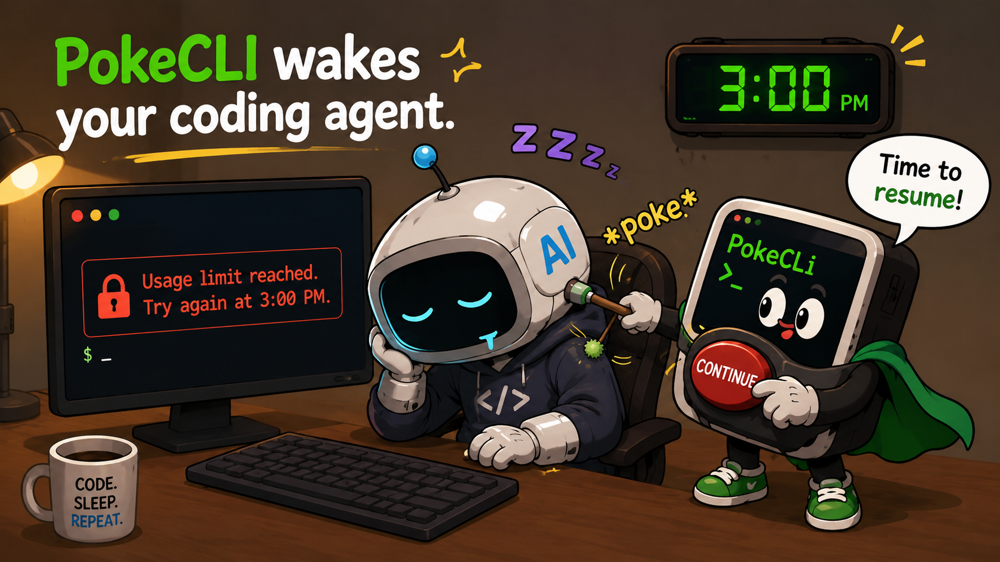

# PokeCLI

PokeCLI keeps Claude or Codex moving after a usage-limit pause.

When your agent prints something like `try again at 3:00 PM`, PokeCLI watches the terminal, parses the reset time, waits until then, checks that the limit message is still visible, and sends your resume message.



## Install

```bash
npm install -g https://github.com/rafsuntaskin/pokecli/releases/download/v0.1.5/pokecli-0.1.5.tgz
```

## Quickstart

```bash
cd /path/to/your/project
poke
```

On first run, choose Claude or Codex. PokeCLI starts the agent in a project-local `tmux` session and starts a watcher in the same session.

Default behavior:

```text
14:00  agent says "try again at 3:00 PM"
14:00  poke schedules "continue" for 15:00
15:00  poke sends "continue"
```

To use a different resume message:

```bash
poke -m=resume
```

That message is saved for the project. To switch back:

```bash
poke -m=continue
```

To detach from tmux without stopping the agent, press `Ctrl-b d`. Run `poke` again from the same project to reattach.

## Requirements

- Node.js 22.5 or newer
- `tmux`
- macOS or Linux (Windows via WSL only)

## Notes

- State is stored in `.poke/` inside your project.
- The tmux server uses a project-local socket at `.poke/tmux.sock`.
- PokeCLI does not use an AI model to decide what to send. It matches known limit messages, parses the reset time, and sends the configured message.
